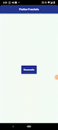

### :sparkles: Flutter Fractals :sparkles:

 

#### Made with:

    
    
    

 
##### :sparkles: What are Fractals? :sparkles:

    A <b>Fractal</b> is a mathematical shape which can be infinitely complex. 
    To put in simple words, a Fractal is a pattern which repeats for ever. As a result of which, no matter how much you are zoomed in or zoomed out of the image, the design looks same as the overall picture.
    As we go about in our daily lives, we cannot help but notice those beautiful design patterns which seem to repeat themselves infinitely. The term `Fractal` was coined by famous mathematician <a href="https://en.wikipedia.org/wiki/Benoit_Mandelbrot">Benoit Mandelbrot</a> 

    The most common and the most famous fractal shown is the Mendelbrot curve. Here is an image of the most famous Mandelbrot Set Curve:

    

    One example of a fractal design is the Koch Snowflake. It starts with an equilateral triangle
    which is then overlapped with an upside down equilateral triangle. The 6 smaller triangnles formed are overlapped again by corresponding inverted triangles of the same shape and size. And the process is repeated infinitely, which results in the beautiful Koch Snowflake. 

An Example is shown below:

    

 

##### :sparkles: What I have done :sparkles:

I was working on generating artistic figures using Flutter and Dart :sad: . But somehow, those figures did not catch the eyes of the audience. That is when, a senior of mine suggested to study and try to generate fractals in my application. This app is a result of that.

I have used pure mathematical calculations and Flutter's internal features to generate 3 different fractal arts:-

* Branching Tree
* Sierpenski Carpet
* Dragon Curve

Flutter's CustomPainter class helps us to build and draw different shapes on a canvas based on our requirements. This CustomPainter has been used to draw our Fractal designs.

A demo of the app:

 

##### :sparkles: Future Plans :sparkles:

* Make the Figures dynamic instead of static
* Make a Live Wallpaper generator Mobile application using the Fractals as design
